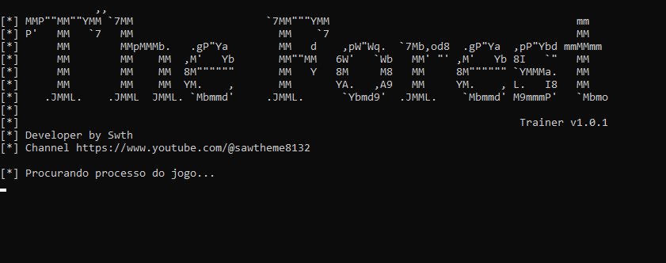
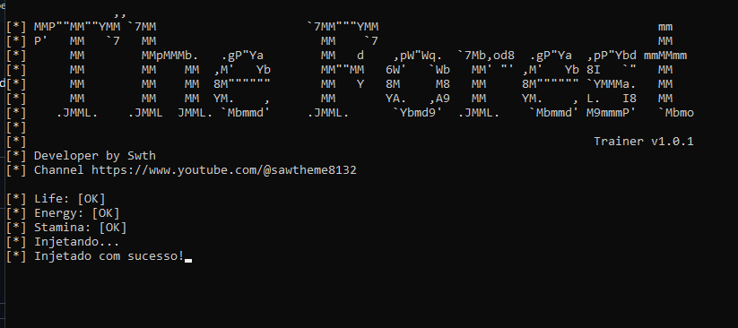
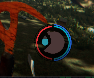

# Trainer para The Forest - v1.0.1

Este projeto é uma ferramenta de manipulação de memória para o jogo **The Forest**, desenvolvida em Python utilizando a biblioteca `pymem`. A ferramenta permite que você modifique variáveis específicas, como vida, energia e stamina do jogador. É especialmente útil para jogadores que desejam uma experiência de jogo modificada, com recursos de sobrevivência otimizados.

**Observação**: Este projeto é para fins educacionais. Modificar jogos pode violar os termos de serviço e levar a restrições de conta. Use com responsabilidade.

## Como Usar

1. Execute o arquivo `Trainer.exe`. A tela inicial exibirá a mensagem "Procurando Processo do Jogo", indicando que o trainer está aguardando que o jogo **The Forest** seja iniciado.

   

2. Abra o jogo **The Forest**. Assim que o jogo estiver em execução, o trainer encontrará automaticamente o processo do jogo e iniciará a injeção das modificações.

   

3. No jogo, você pode visualizar os efeitos do trainer. A vida, energia e stamina do jogador serão mantidas em níveis constantes de 100, o que garante uma experiência sem quedas nesses atributos.

   ### Antes da injeção:
   

   ### Após a injeção:
   

## Funcionalidades

O trainer oferece as seguintes funcionalidades:

- **Vida**: Mantém a vida do jogador em 100%.
- **Energia**: Mantém a energia do jogador em 100%.
- **Stamina**: Mantém a stamina do jogador em 100%.

Essas modificações são aplicadas automaticamente enquanto o trainer está em execução e o processo do jogo está ativo.

## Aviso

A modificação de jogos de maneira não autorizada pode violar os Termos de Serviço do jogo e acarretar penalidades. Recomendo o uso dessa ferramenta apenas para uso pessoal, offline!

## Contribuições

Se desejar contribuir com melhorias para este projeto, faça um fork do repositório e envie um pull request. Sugestões para novas funcionalidades e melhorias são bem-vindas!
